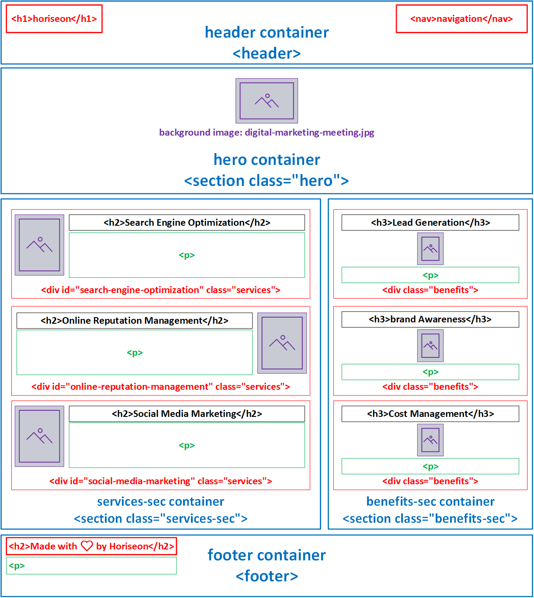

# Horiseon Webpage Refactoring

# Acceptance Criteria
The following items requirements were provided as the scope of work and acceptance criteria.

### Item 1
> - WHEN I view the source code
> - THEN I find semantic HTML elements

### Item 2
> - WHEN I view the structure of the HTML elements
> - THEN I find that the elements follow a logical structure independent of styling and positioning

### Item 3
> - WHEN I view the image elements
> - THEN I find accessible alt attributes

### Item 4
> - WHEN I view the heading attributes
> - THEN they fall in sequential order

### Item 5
> - WHEN I view the title element
> - THEN I find a concise, descriptive title

# Code Refactoring 
The following narrative details the refactoring of the code contained in the .html and .css files to satisfy the acceptance criteria.  

## .HTML File Modifications

### <head> Container
> - Changed <title> from "website" to "Horiseon | Search Optimization, Online Reputation, and Social MediaHoriseon | Search Optimization, Online Reputation, and Social Media". 
>> - Limited character count to 60 in order to optimize browser tab visualization.
>> - Incorparated the company name and services to improve search engine ranking and site accessibility. Moreover, the <title> content is an element included in search results and utilized by accessibility resources, such as screen reader extensions.
> - Added "keywords" meta tag with relevant page key words for search engine optimization.
>> - Keywords included: "search optimization,reputation management,social media,online marketing,seo,orm,lead generation,brand awareness"
> - Added "description" meta tag to describe the page content for search engine optimization.
>> - Description included: "Services to optimize your business digital marketing on search engine and social media platforms."
>> - The content in the <description> meta tag is an element included in search results of some search engines and utilized by accessibility resources, such as screen reader extensions.

### Body Container - <body> 
The <body> element includes the following major elements / containers. Moreover, both the .css and .html files are organized and noted by the following major elements / containers. 
>> - <header> header container
>> - <section class="hero"> hero container
>> - <section class="services-sec"> services-sec container
>> - <aside class="benefits-sec"> benefits-sec container
>> - <footer> footer container

Click the following link to view a detailed layout of the elements/containers within the <body> element. 

### Header Container - <header>
> - Changed the header container from a 
 to a <header> tag. Designating the container with the <header> element formalizes it as the top-most viewable section of the web page and includes the company's badge and site navigation links.
>> Original code
>>> 

>> New Code
>>> <header>

### Hero Container - <section class="hero">
> - Changed the header container from a 
 to a <section> tag. Although both are block elements the <section> tag formalizes the hero container as an important section of the page. 
>> Original code
>>> 

>> New Code
>>> <section class="hero"></section>
> - Changed from a 
 to a <nav> tag. Although both are block elements the <nav> tag appropriately categorizes the <ul>,<li>,and <a href> content as page navigation code.

### Services-Sec Container
> - Changed services-sec container from a 
 to a <section> tag. Although both are block elements the <section> tag formalizes the services-sec container as an important section of the page; and
> - Changed the name of the class name for the container from "content" to "services-sec". The class name is more specific to the content nested within its section of the page.
>> Original code
>>> 

>> New Code
>>> <section class="services-sec">

> - Added id="search-engine-optimization" to the Search Engine Optimization 
. This enabled the page's navigation link for "Search Engine Optimization" located in the <header>: and
> - Removed the three separate css classes and replaced them with a single class named "services". All three classes had the same styling parameters in the css file.
>> Original Code
>>> 

>>> 

>>> 

>> New Code
>>> 

>>> 

>>> 

> - Added alt tags to images, which were missing.
>> Original Code
>>> 
>>> 
>>> 
>> New Code
>>> 
>>> 
>>> 

### Services-Sec Container
> - Changed benefits-sec container from a 
 to the <aside> tag. Although both are block elements the <aside> tag is more appropriate since its defining the benefits of the services in the Services-Sec Container; and
> - Changed the name of the class name for the container from "benefits" to "benefits-sec". The class name is more specific to the content nested within its section of the page.
>> Original Code
>>> 

>> New Code
>>> <aside class="benefits-sec">

> - Corrected  tag closing; and
> - Added alt tags to images, which were missing
>> Original Code
>>> 
>>> 
>>> </img>
>> New Code
>>> 
>>> 
>>> 

> - Removed the three separate css classes and replaced them with a single class named "services". All three classes had the same styling parameters in the css file.
>> Original Code
>>> 

>>> 

>>> 

>> New Code
>>> 

### Footer Container
> - Changed footer from a 
 to the <footer> tag. Although both are block elements the <footer> tag is more appropriate since it is at the bottom of the page and contain copyright information. By using the <footer> element a separate class name is not necessary.
>> Original Code
>>> 

>> New Code
>>> <footer>

## CSS File Modifications
As previously noted, both the .css and .html files are organized and noted by the following major elements / containers. 
>> - <header> header container
>> - <section class="hero"> hero container
>> - <section class="services-sec"> services-sec container
>> - <aside class="benefits-sec"> benefits-sec container
>> - <footer> footer container

Other CSS file modifications include
> - Added :root class to CSS to provide definitions for frequently used color and font-family styles
>> New Code
>>> :root {
>>>> --color-one: #d9dcd6;
>>>> --color-two: #ffffff;
>>>> --color-three: #0072bb;
>>>> --font-family-one: "Trebuchet MS", "Lucida Sans Unicode", "Lucida Grande", "Lucida Sans", Arial, Sans-Serif;
>>>> --font-family-two: "Gill Sans", "Gill Sans MT", "Calibri", "Trebuchet MS", Sans-Serif;
>>> } 
> - Used var() to replace individual definitions for colors and font-family throughout the style sheet. The var() deployed referenced the variables defined in the newly added :root style.
>> Original Code
>>> background-color: #d9dcd6;
>>> background-color: #0072bb;
>>> color: #ffffff;
>>> font-family: "Trebuchet MS", "Lucida Sans Unicode", "Lucida Grande", "Lucida Sans", Arial, Sans-Serif;
>>> font-family: "Gill Sans", "Gill Sans MT", "Calibri", "Trebuchet MS", Sans-Serif;
>> New Code
>>> background-color: var(--color-one);
>>> background-color: var(--color-three);
>>> color: var(--color-two);
>>> font-family: var(--font-family-one);
>>> font-family: var(--font-family-two);
> - Replaced three classes ("search-engine-optimization","online-reputation-management","online-reputation-management") with a single class named "services". The three classes that were replaced contained the same styling parameters, which were retained in the new class.
> - Replaced three classes ("benefit-lead","benefit-brand","benefit-cost") with a single class named "benefits". The three classes that were replaced contained the same styling parameters, which were retained in the new class.
> - Renamed class from ".header " to "header "
> - Renamed class from ".header h1" to "header h1"
> - Renamed class from ".header div" to "header nav"
> - Renamed class from ".header div ul" to "header nav ul"
> - Renamed class from ".header div ul li" to "header nav ul li"
> - Renamed class from ".footer" to "footer"
> - Renamed class from ".footer h2" to "footer h2"